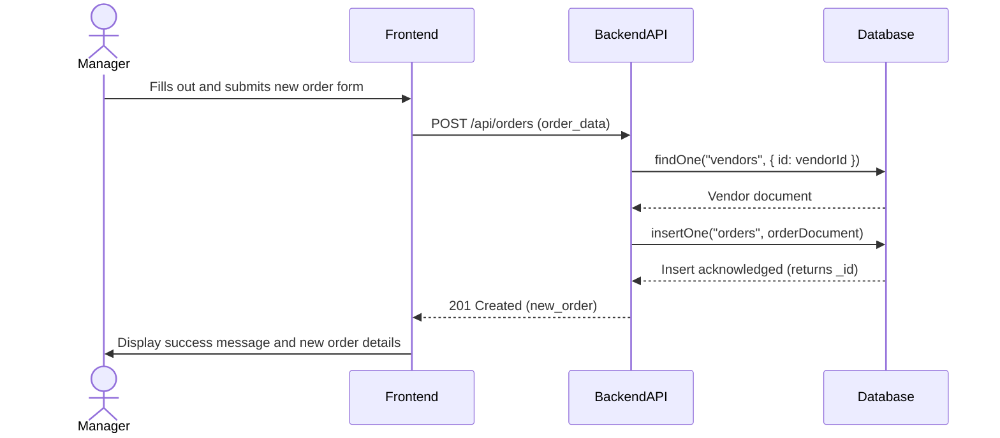
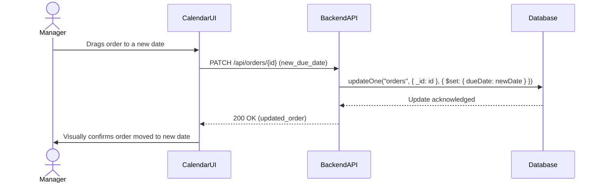
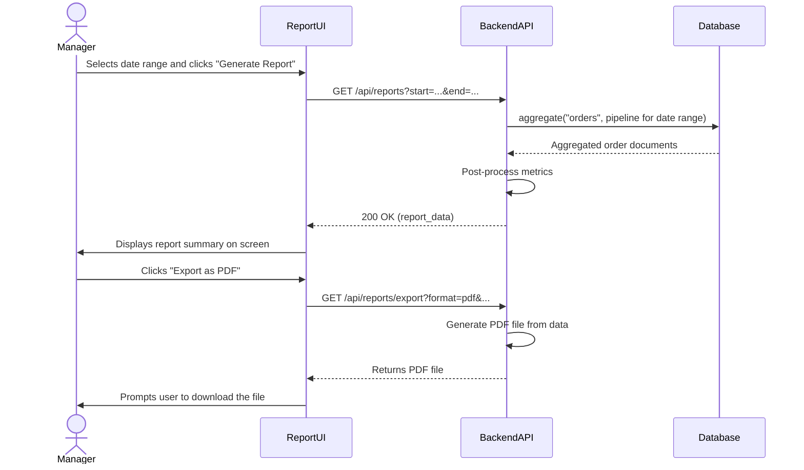
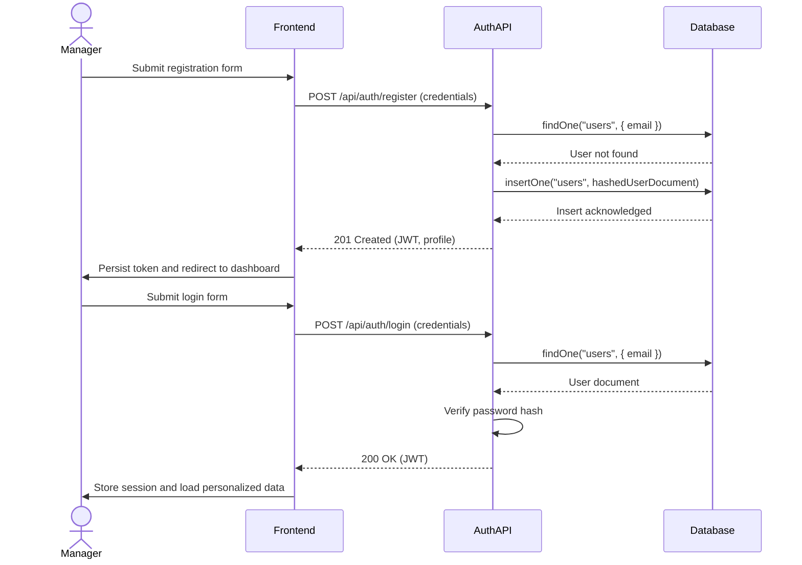
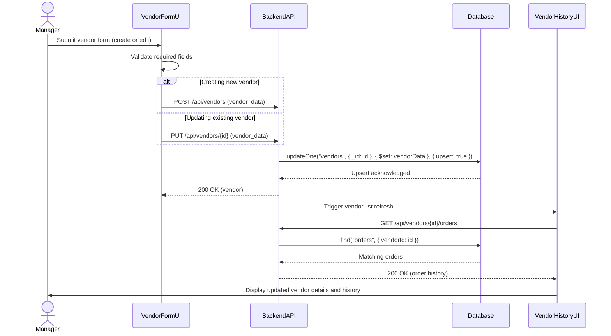
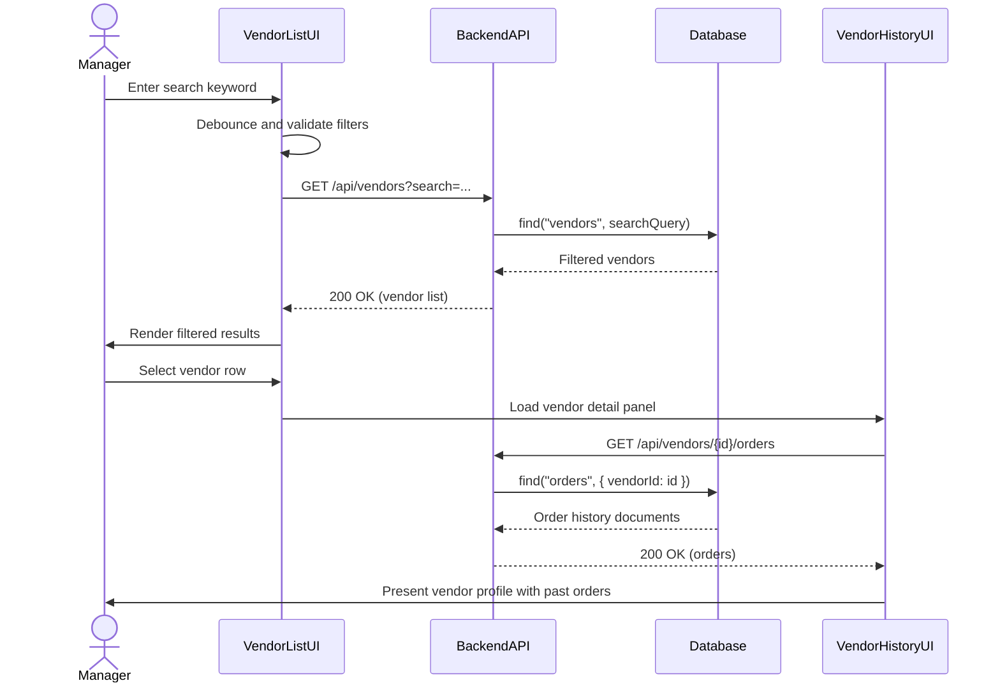
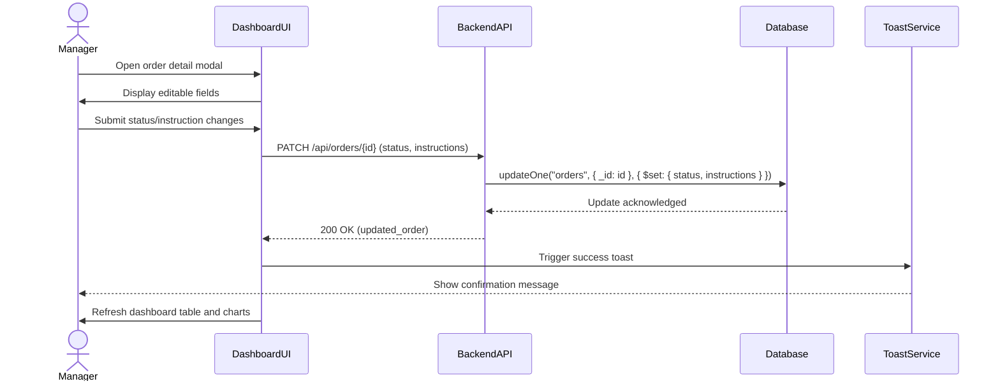

## 3. Sequence Diagrams

These diagrams capture the dynamic interactions between actors and system components for key OptiFlow use cases.

### 3.1 Use Case: Create a New Order

This sequence shows the process of a Production Manager creating a new production order and associating it with a vendor.

### 3.2 Use Case: Reschedule Order via Calendar

This sequence details the interaction when a manager drags and drops an order to a new date on the calendar.

### 3.3 Use Case: Generate Vendor Activity Report

This sequence illustrates the process of generating and downloading a report based on a specified date range.

### 3.4 Use Case: User Authentication (Register & Login)

This sequence covers FR-1 and requirement 1.2.1, showing secure registration and login flows between the frontend, authentication service, and database.

### 3.5 Use Case: Vendor Management (Create / Edit Vendor)

This sequence addresses requirement 1.2.2 and FR-2 by outlining how a manager creates or updates vendor records and refreshes related history.

### 3.6 Use Case: Vendor Search and History View

This sequence supports requirement 1.2.2 by demonstrating filtered vendor lookup and loading of associated orders for quick context.

### 3.7 Use Case: Update Order Status from Dashboard

This sequence covers requirement 1.2.3 by capturing how a manager edits an order's status or instructions from the dashboard modal and receives confirmation.

